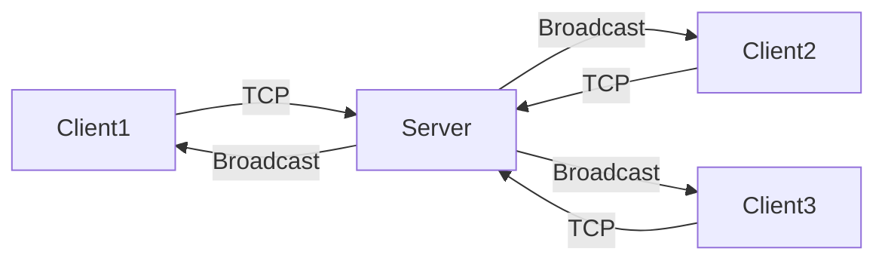
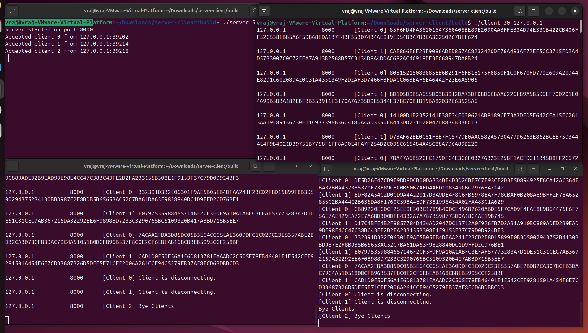
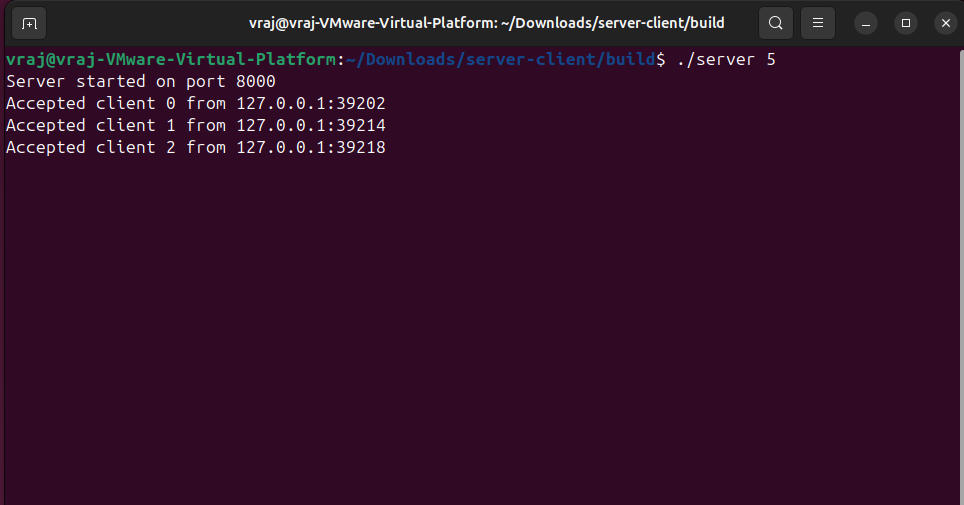

# Multi-Client TCP Group Chat Server with Fuzzing Clients

This project implements a multi-client TCP group chat system in C using POSIX threads.
The server accepts concurrent client connections, relays messages between clients, and enforces a structured message protocol.

Each client acts as a simple fuzzer that generates random messages, sends them to the server, and concurrently receives messages from other clients.

This project was developed to practice low-level socket programming, concurrency control, protocol design, and graceful distributed termination in Linux.


# Project Overview

The system consists of two programs:

- `server` — A multi-threaded TCP group chat server  
- `client` — A fuzzing client that generates and sends random messages  

The server:

- Uses `AF_INET`
- Binds to all available local IP addresses
- Listens on port `8000`
- Supports up to `<max clients>` connections (specified at runtime)
- Broadcasts every message to all connected clients
- Preserves message ordering
- Implements a simplified Two-Phase Commit protocol for clean shutdown

The client:

- Generates random messages using `getentropy()`
- Sends messages following the defined protocol
- Prints every received message in formatted output
- Sends a termination signal after a specified duration


# System Architecture

Each client establishes a TCP connection to the server.
The server creates one thread per client and relays messages to all connected clients.



The server ensures:

- Messages from a single client are delivered in sending order.
- All clients observe the same global message order.


# Message Protocol

Communication between the server and clients follows a structured format.

Each message begins with a one-byte type field and ends with a newline character (`\n`).

## Message Types

### Type 0 — Regular Chat Message

- Sent by clients to deliver chat content.
- When relaying a type 0 message, the server adds:
  - Sender IP address (`uint32_t`)
  - Sender port number (`uint16_t`)
- This allows all clients to identify the original sender.

### Type 1 — Termination Signal

- Sent by a client when it finishes generating messages.
- After the server receives a type 1 message from all clients, it broadcasts a type 1 message to all clients and terminates.
- Clients terminate after receiving the server’s type 1 message.

This design ensures consistent formatting and coordinated shutdown of the distributed system.


# Demonstration

## Multi-Client Broadcast Demo

The screenshot below shows:

- The server running on port 8000  
- Two fuzzing clients generating random messages  
- One external client connected using `nc`  
- Broadcasted messages received by all clients  

This demonstrates concurrent client handling and correct message relaying behavior.




## Server Connection Logs

The screenshot below shows the server:

- Starting successfully  
- Accepting multiple client connections  
- Running without crashes during concurrent activity  




# Build Instructions

```bash
mkdir -p build
cd build
cmake ..
cmake --build .
```


# Run Instructions

Start the server:

```bash
./server <max clients>
```

Example:

```bash
./server 5
```

Start a client:

```bash
./client <# of seconds>
```

Example:

```bash
./client 30
```

Optional: Test using an external client

```bash
nc 127.0.0.1 8000
```

# Technical Concepts Practiced

- TCP socket lifecycle (`socket → bind → listen → accept`)
- IPv4 networking with `AF_INET`
- Multi-threaded concurrency using POSIX threads
- Mutex synchronization for shared client management
- Structured message protocol design
- Message ordering guarantees
- Coordinated distributed termination (Two-Phase Commit model)
- Concurrent send/receive handling in clients


# Code Structure

- `src/` — Source files  
- `include/` — Header files  
- `CMakeLists.txt` — Build configuration  

The project produces two executables:

- `server`
- `client`


